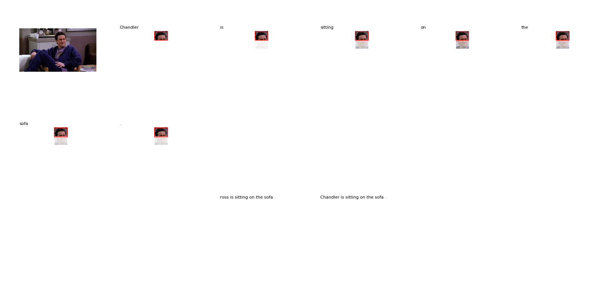
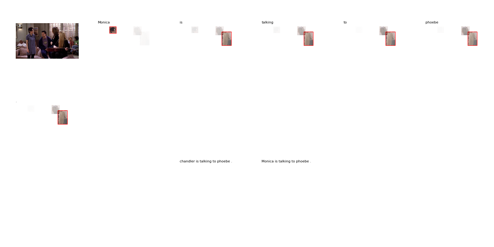

# Image Captioning with Face Recognition

VTT 전용 프로젝트.
제 저장소의 [다른 프로젝트](https://github.com/vtt3-research/airi/tree/master/Top-Down%20Attention%20for%20Image%20Captioning)를 기반으로 동작하는 프로젝트입니다.

This project is based on another project in my repository called ['image captioning'](https://github.com/vtt3-research/airi/tree/master/Top-Down%20Attention%20for%20Image%20Captioning).


## Requirements

- Python 2.7
- Tensorflow
- [My other project](https://github.com/vtt3-research/airi/tree/master/Top-Down%20Attention%20for%20Image%20Captioning)
- Object Detection module provided by [Peter Anderson’s github](https://github.com/peteanderson80/bottom-up-attention) must be installed
- Face Recognition module : I use the module provided by Sogang University belonging to this VTT project group.
You must use other face recognition modules or open APIs and modify `vtt_face_recognize` function in the `vtt_face_api.py` file.


* VTT-3세부 그룹원은 서강대의 얼굴 인식을 사용하면 됩니다. 테스트시 URL 옵션에 해당 주소를 넣어주시면 됩니다.


## Dataset

이 프로젝트에서는 제 저장소의 다른 프조젝트에서 사용한 데이터셋과 학습 모델을 사용하기 때문에 특별히 데이터셋이 따로 필요가 없습니다.
다만, 여기서는 [코난테크놀로지](https://github.com/vtt3-research/konantech)에서 제공하는 '프렌즈' 시즌의 메타데이터를 가져와 데이터셋을 가공하여 사용합니다.
가공된 데이터파일은 [제 구글드라이브](https://drive.google.com/file/d/1g3hEy7miyPBJTaC1J7lrrQzWbzWcmEwI/view?usp=sharing)에서 다운로드할 수 있습니다.

데이터셋은 프렌즈 시즌1(EP01~EP23)이며, training set은 EP01~22, test set은 EP23으로 분리하여 사용했습니다.

You do not need a dataset because you can use the pre-processed dataset and the learned model from my ['image captioning' repository](https://github.com/vtt3-research/airi/tree/master/Top-Down%20Attention%20for%20Image%20Captioning).
But I use the ‘Friends’(sitcom) season1 meta data provided by [Konan Tech.](https://github.com/vtt3-research/konantech).
The processed data file can be downloaded [here](https://drive.google.com/file/d/1g3hEy7miyPBJTaC1J7lrrQzWbzWcmEwI/view?usp=sharing).

Dataset include training set (EP01~22) and test set (EP23) for ‘Friends’(sitcom) season1.

## Test

```
python run_test_using_face_recog.py --input_labels {preprocessed file on the 'image captioning' repo.} --input_caps {preprocessed file on the 'image captioning' repo.} --bottomup_path {installed bottom-up attention path} --test_model {learned weight file}
```

Enter the test image file (path+name).


## Results






### Evaluation
|                   | BLEU-1 | BLEU-4 | CIDEr | METEOR |
|-------------------|:-------------------:|:------------------------:|:---------------------:|:---------------------------:|
| Implementation (original captioning) | 39.60  | 12.60 | 50.50 | 19.00 |
| Implementation (using face recognition) | 40.43  | 13.13 | 55.58 | 20.06 |