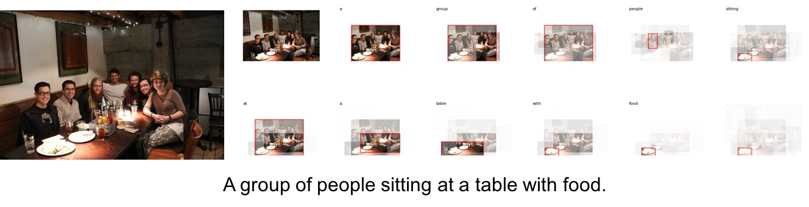
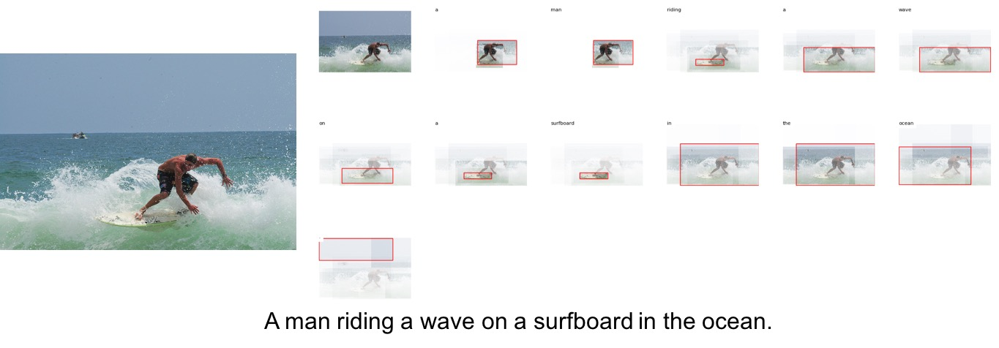

# Top-Down Attention for Image Captioning
This is an unofficial Tensorflow implementation for Image Captioning model proposed by Anderson, Peter, et al. in the paper [Bottom-Up and Top-Down Attention for Image Captioning and Visual Question Answering](https://arxiv.org/abs/1707.07998).

<br/>

## Requirements
* Python 2.7 or 3.5
* Tensorflow 1.2.1

## Pretrained models
If you want to test immediately without training (But you need to preprocess.), download a [pre-trained model](https://drive.google.com/open?id=1HOK8jn6jl3S44AM4_gAIAFjI5etF258K).
```
unzip topdowndttention_model.zip
```

## Training

### Download dataset
To train the model, first download dataset, and feature data. We use MSCOCO dataset from [MSCOCO homepage](http://cocodataset.org/#download), preprocessed coco captions from [Karpathy’s homepage](http://cs.stanford.edu/people/karpathy/deepimagesent/caption_datasets.zip) and pre-traind features from [Peter Anderson’s github](https://storage.googleapis.com/bottom-up-attention/trainval_36.zip). When the download finishes, move the file as follows.
```
unzip caption_datasets.zip -d data/coco/
unzip trainval_36.zip -d data/coco/
mv data/coco/trainval_36/trainval_resnet101_faster_rcnn_genome_36.tsv data/coco/
rmdir data/coco/trainval_36/
unzip train2014.zip -d data/image/
unzip val2014.zip -d data/image/
```

### Preprocessing
Before training the model, you need to preprocess the MSCOCO dataset. To generate caption data, image feature vectors and n-gram for captions in the dataset, run the command as follows.
```
python prepro_captions.py
python prepro_features.py
python prepro_ngram.py
```

### Training
To train the model, run the command as follows.
```
python train.py --mode TRAIN
```

## Testing
To test the model for MSCOCO, run the command as follows.
```
python train.py --mode TEST
```
If you want to run the full process, you can add the Bottom-Up Attention Model part by referring to the demo.ipynb in [Peter Anderson’s github](https://github.com/peteanderson80/bottom-up-attention).

## Result
The quantitative and qualitative evaluation of this code is as follows:

### data for testing in MSCOCO 2014 val images.





### evaluation
|                   | BLEU-1 | BLEU-4 | METEOR | ROUGE-L | CIDEr |
|-------------------|:-------------------:|:------------------------:|:---------------------:|:---------------------------:|:---------------------------:|
| Implementation | 0.777  | 0.341 | 0.264 | 0.556 | 1.084 |

