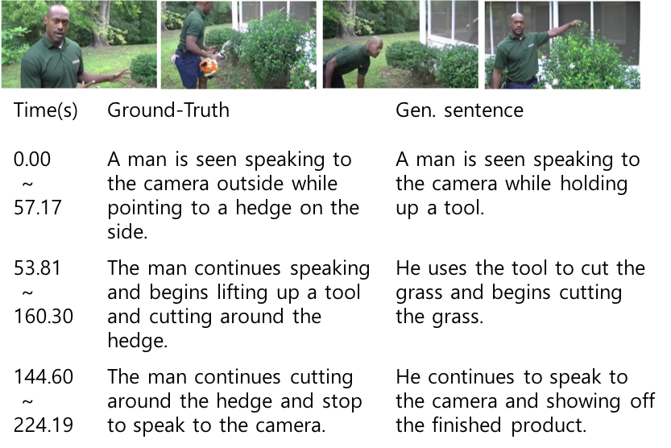
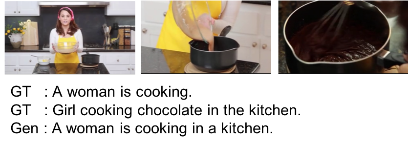
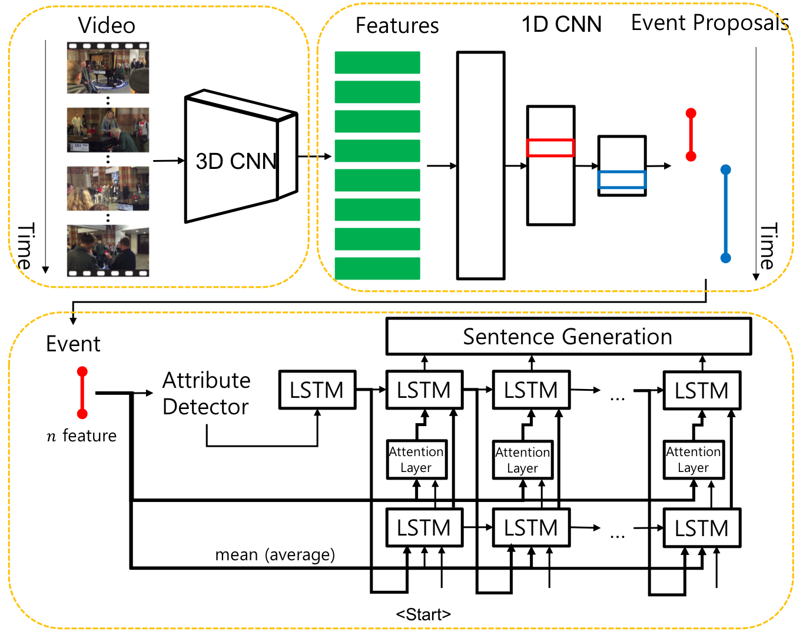

# Video Captioning

This repo implements the code for video captioning, based on the paper [Joint Localizing and Describing Events for Dense Video Captioning](https://arxiv.org/abs/1804.08274) (CVPR 2018).

* Upload new model (modified original model)

## Requirements

- Python 2.7
- PyTorch 0.4.0

python packages
- h5py
- json
- numpy


## Pretrained models

...

## Dataset

The ActivityNet annotation dataset can be download from [Activity Net homepage](http://activity-net.org/download.html).
And ActivityNet caption dataset and C3D video features also can be download from [Dense-Captioning Events in Videos](https://cs.stanford.edu/people/ranjaykrishna/densevid/).

When you download all datasets, put `activity_net.v1-3.min.json` file in the folder `data/` , put feature file in the folder `data/actnet/`, and unzip `captions.zip` in the folder `data/`.

Finally, the files are organized as follows.

```
data/
-- actnet/
---- sub_activitynet_v1-3.c3d.hdf5
-- captions/
---- test_ids.json
---- train.json
---- train_ids.json
---- val_1.json
---- val_2.json
---- val_ids.json
-- activit_net.v1-3.min.json
```

## Training

You can input various argument options that are not listed below.
If you want to use other options, see the argument part in each file.

### 1. Preprocessing

Before training the model, you need to preprocess the dataset.

```
python prepro_atts.py
python prepro_caps.py
```

The first is the dataset preprocessing for attribute detector.
The second is the dataset preprocessing used to train the sentence generator and dense video captioning.

### 2. Training for attribute detector

```
python run_detector.py --file-name {output file name}
```

### 3. Training for sentence generator

Use the weight of the attribute detector trained in the previous step.

```
python run_sent_gen.py --file-name {output file name} --resume-att {attribute detector weight file}
```

### 4. Training for dense video captioning

Use the weight of the attribute detector and sentence generator trained in the previous step.

```
python run_dvc.py --file-name {output file name} --resume-att {attribute detector weight file} --resume-sg {sentence generator weight file}
```

If you want to learn more with reinforcement learning (Self-Critical), you can do the following additional tasks.

```
python run_dvc.py --file-name {output file name} --resume-att {attribute detector weight file} --resume-sg {sentence generator weight file} --resume-dvc-xe {dvc weight file above} --rl-flag
```

(Experimental) A lot of epochs with reinforcement learning improves the quantitative evaluation(METEOR, CIDEr, etc.), but the qualitative evaluation becomes worse.

## Result

For validation set, qualitative and quantitative evaluation.

Not best score...




### Evaluation

|                   | BLEU-4 | CIDEr | METEOR |
|-------------------|:-------------------:|:------------------------:|:---------------------:|
| Implementation | 1.32  | 29.22 | 9.37 |


## Video Testing

You can test your videos with a learned model.
To test the video, we need a model that extracts features from the video.
We copied the C3D model of [Davide Abati’s github](https://github.com/DavideA/c3d-pytorch) and made some modifications to this model.
Download the pretrained C3D weight file as described in the [Davide Abati’s github](https://github.com/DavideA/c3d-pytorch).
We need to also ActivityNet PCA file to reduce video-feature dimension.
Click [PCA_activitynet_v1-3](http://activity-net.org/challenges/2016/download.html#c3d) and download a file.
Finally, move the files to `data/` folder.

```
data/
-- c3d.pickle
-- PCA_activitynet_v1-3.hdf5
```

```
python run_video.py --video-root {your video root folder} --resume-att {attribute detector weight file} --resume-dvc {dvc weight file}
```

Run testing above, and enter the video filename in the video root folder.


## For another dataset

### MSR-VTT dataset

MSR-VTT is one of the popular video caption datasets.
However, MSR-VTT only has captions for the full length of the video.
Therefore, it is not necessary to extract the event proposal.
So we learn the sentence generation model without using the event extraction model.

1. Prepare data files

Download the dataset from [MSRVTT homepage](ms-multimedia-challenge.com/2016/dataset) and prepare features from MSRVTT video set using C3D model
Features file type is hdf5 and contain video name, feature vector pairs as follows.

```
features = h5py.File('features.hdf5', 'r')

# video name : video0
feat = features['video0'].value
```

Or, you can use the file I created [here](https://drive.google.com/file/d/1vm_Lh6RF1qgGOxSUyTb0p0ajJVqVKR2b/view?usp=sharing).
This file uses the C3D model in the repository to extract features for each video, calculate and store the average.

Data files are organized as follows.

```
data/
-- MSRVTT/
---- videodatainfo.json
---- msrvtt_features.hdf5
```

2. Preprocessing

Preprocess dataset.

```
python prepro_msrvtt.py
```

3. Training

Training the attribute detector model.

```
python run_detector.py --root data/MSRVTT --file-name {output file name} --feature-dim {MSR-VTT feature dimension} --num-class 20
```

And training the sentence generator model using trained attribute detector model.

```
python run_sg_msrvtt.py --file-name {output file name} --resume-att {attribute detector weight file} --feature-dim {MSR-VTT feature dimension}
```

If you want to use reinforcement learning (Self-Critical) additionally, input rl-flag option.

```
python run_sg_msrvtt.py --file-name {output file name} --resume-att {attribute detector weight file} --resume-sg {sentence generator weight file above} --feature-dim {MSR-VTT feature dimension} --rl-flag
```

For each epoch, automatically evaluate metric with (current) trained model for the validation set.

4. Result

For validation set, qualitative and quantitative evaluation.

Not best score...




|                   | BLEU-4 | CIDEr | METEOR |
|-------------------|:-------------------:|:------------------------:|:---------------------:|
| Implementation | 34.56  | 33.37 | 24.56 |

## New Model

### Framework



### Test

Download pre-trained data from [here](https://drive.google.com/drive/folders/1iPTidKqO8LG0-3h1HYX1jK5wo8ylrzeC?usp=sharing) and move files as follow.
This file trained with ActivityNet Captions training set and MSR-VTT Dataset.


```
data/
-- actnet_msrvtt/
---- word_to_idx.json
models/
-- att_model.pth.tar
-- c3d.pickle
-- sg_model.pth.tar
-- tep_model.pth.tar
```

Run `new_test.py` and enter the video file path and name.